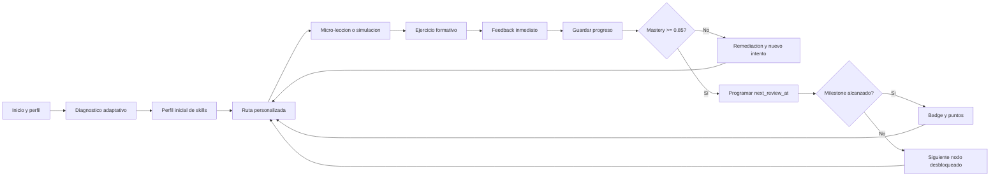
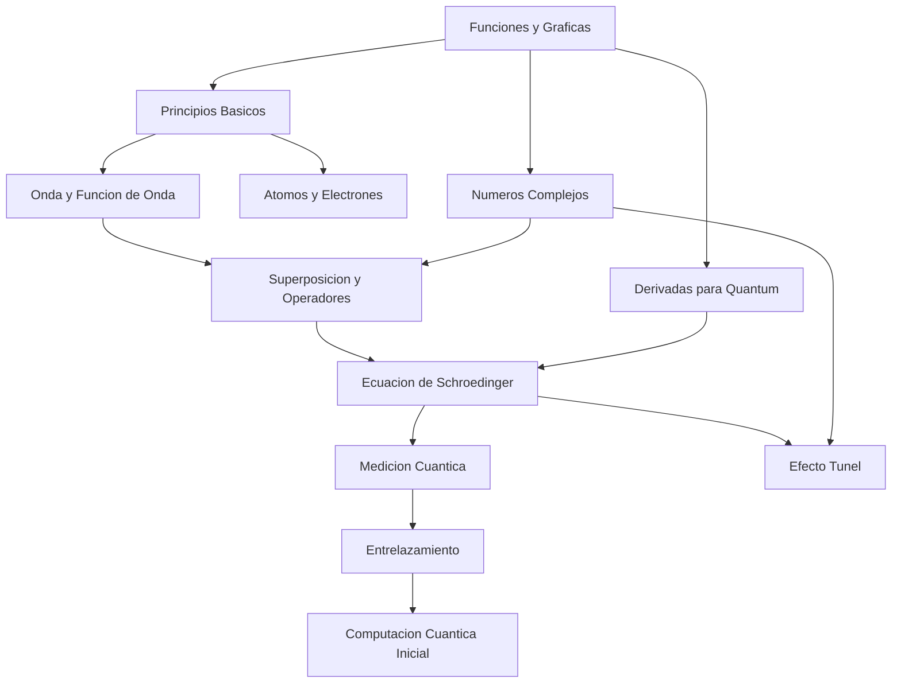
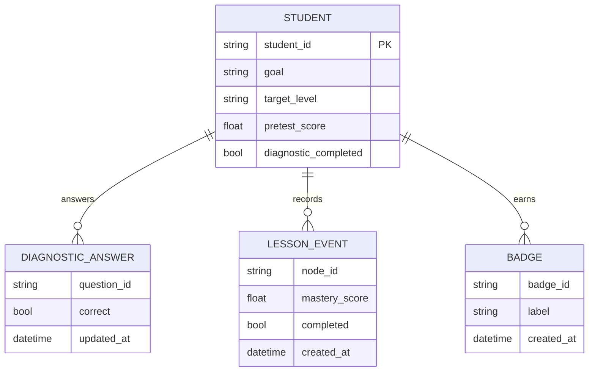

# Adaptive Learning Blueprint

## Executive Summary

Quantum Tutor now has a first operational foundation for guided learning:

- curriculum graph with prerequisites, levels and milestones
- adaptive initial diagnostic with question bank by skill
- personalized routing based on progress, remediation, mastery learning and spaced repetition
- formative feedback with 5-step guidance and misconception tracing
- lightweight gamification with points and badges
- deterministic content generators for exercises and micro-lessons

This slice is intentionally file-backed and deterministic so it can run in the current repo without adding external services. It is designed to evolve later toward IRT, BKT, richer analytics, LMS/LTI and notebook integrations.

## What Is Implemented Now

### Core engine

- `adaptive_learning_engine.py`
- persistent state in `outputs/state/learning_*.json`
- milestone and badge tracking
- remediation queue informed by both diagnostic errors and runtime struggle analytics
- mastery threshold `0.85` for progression
- spaced repetition fields per node: `next_review_at`, `retention_score`, `review_count`
- learner persona and adaptive difficulty profile synced into `student_profile.json`

### API surface

- `GET /api/diagnostico-inicial`
- `POST /api/evaluar-respuesta`
- `GET /api/ruta-personalizada`
- `POST /api/guardar-progreso`
- `GET /api/curriculum`
- `GET /api/learning-kpis`
- `GET /api/learning-review-queue`
- `GET /api/learning-insights`
- `POST /api/guardar-evaluacion`
- `GET /api/learning-cohort-report`
- `POST /api/learning-cohort-export`

Legacy-friendly aliases are also exposed:

- `GET /diagnostico_inicial`
- `POST /evaluar_respuesta`
- `GET /ruta_personalizada`
- `POST /guardar_progreso`

### Content assets

- `scripts/generar_ejercicios.py`
- `scripts/generar_leccion.py`
- `prompts/generar_ejercicios.md`
- `prompts/generar_feedback.md`
- `templates/micro_leccion.md`

## Pedagogical Architecture

### Skills tracked in v1

| Skill | Focus |
| --- | --- |
| `foundations` | dualidad, probabilidad, funcion de onda |
| `mathematical_foundations` | funciones, derivadas y complejos para QM |
| `mathematical_formalism` | superposicion, operadores, Schroedinger |
| `measurement` | medicion, incertidumbre, tunel |
| `applications` | entrelazamiento, qubits, circuitos |

### Curriculum graph

## Milestones

| Milestone | Required nodes | Purpose |
| --- | --- | --- |
| `starter_foundations` | `qm_principios_basicos`, `qm_onda_funcion_onda` | secure conceptual entry |
| `schrodinger_ready` | `qm_superposicion_operadores`, `qm_ecuacion_schrodinger` | unlock formal problem solving |
| `measurement_practitioner` | `qm_medicion_cuantica`, `qm_efecto_tunel` | bridge theory with experiments |
| `quantum_applications` | `qm_entrelazamiento`, `qm_computacion_cuantica` | enter advanced applications |

## Data Model Snapshot

## Personalization Model Roadmap

| Model | Status | Strength | Cost |
| --- | --- | --- | --- |
| Heuristic skill estimates | Implemented now | simple, transparent, deterministic | low |
| Knowledge graph prerequisites | Implemented now | maps route and remediation cleanly | low-medium |
| IRT diagnostics | Planned next | sharper placement and item calibration | high |
| BKT per skill | Planned next | temporal mastery tracing | medium |
| Bayesian network routing | Planned later | multi-skill dependency modeling | high |
| RL policy selection | Research only | long-horizon optimization | very high |

## Endpoint Contract

| Endpoint | Purpose | Core output |
| --- | --- | --- |
| `GET /api/diagnostico-inicial` | deliver initial adaptive questions | questions, target level, modalities |
| `POST /api/evaluar-respuesta` | score answer and give formative feedback | correctness, 5-step feedback, misconceptions, route preview |
| `GET /api/ruta-personalizada` | return next recommended node | next node, alternatives, milestones, review queue |
| `POST /api/guardar-progreso` | persist mastery and completion | updated progress, badges, route, mastery threshold |
| `GET /api/curriculum` | expose curriculum contract | levels, milestones, nodes |
| `GET /api/learning-review-queue` | expose due and upcoming reviews | review queue with retention and next review |
| `GET /api/learning-insights` | aggregate experimental evidence | multidimensional cohorts, ITS metrics, recommendations |

## Suggested Production Evolution

### Phase 1

- ship current deterministic learning engine
- connect UI to diagnostic and routing endpoints
- add lesson cards and milestone visualization
- derive lightweight progress signals from live chat interactions
- expose pretest/posttest and completion KPIs in the analytics dashboard
- add stable A/B gamification assignment and simple cohort export

### Phase 2

- calibrate question bank for IRT
- enrich question authoring workflow
- add rubric-backed open responses
- add pre/post KPI dashboards

### Phase 3

- add Redis/PostgreSQL persistence
- connect LMS via LTI
- notebook launchers and simulator embeds
- A/B testing for gamification and feedback variants

## Metrics

Track at minimum:

- pretest vs posttest improvement
- module completion rate
- time to milestone
- retry rate after wrong answer
- simulator usage rate
- badge unlock distribution
- satisfaction survey score

## Accessibility Notes

- keep micro-lessons short and scannable
- avoid feedback that depends only on color
- support keyboard-first navigation
- provide captions/transcripts for future media
- keep simulator alternatives documented when embed is not accessible
